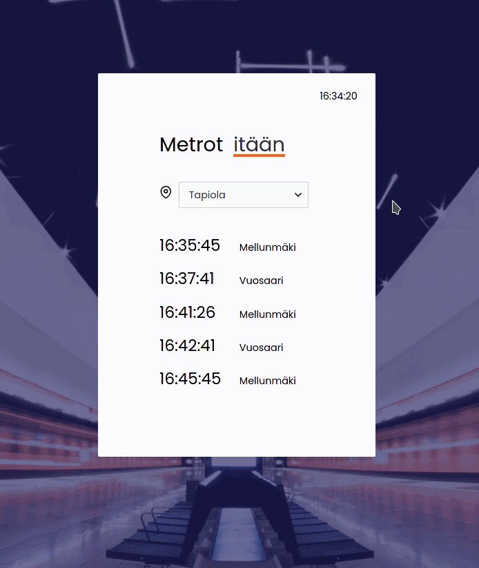

# Metro Timetable App

An app displaying Helsinki metro timetable.

<br />



<br />

Choose your station and direction and see the next departures.

The app fetches data from [Digitransit Routing API](https://digitransit.fi/en/developers/apis/1-routing-api/). Data is provided by Helsinki Region Transport and licenced under [Creative Commons BY 4.0 International](https://creativecommons.org/licenses/by/4.0/) -license.

Background image is by [Julius Jansson](https://unsplash.com/@juliusjansson?utm_source=unsplash&amp;utm_medium=referral&amp;utm_content=creditCopyText) on [Unsplash](https://unsplash.com/s/photos/keilaniemi?utm_source=unsplash&amp;utm_medium=referral&amp;utm_content=creditCopyText).

## Get started

In order to get your own metro timetable working, you need [Node.js](https://nodejs.org/en/download/).

Then, clone this project and go to the project directory:

```
git clone https://github.com/nellileinonen/metro-info.git
cd metro-info
```

In the project directory, install dependencies and start the development server:

```
npm install
npm start
```

Open [http://localhost:3000](http://localhost:3000) to view the app in the browser.

Enjoy your metro timetable! :train2: